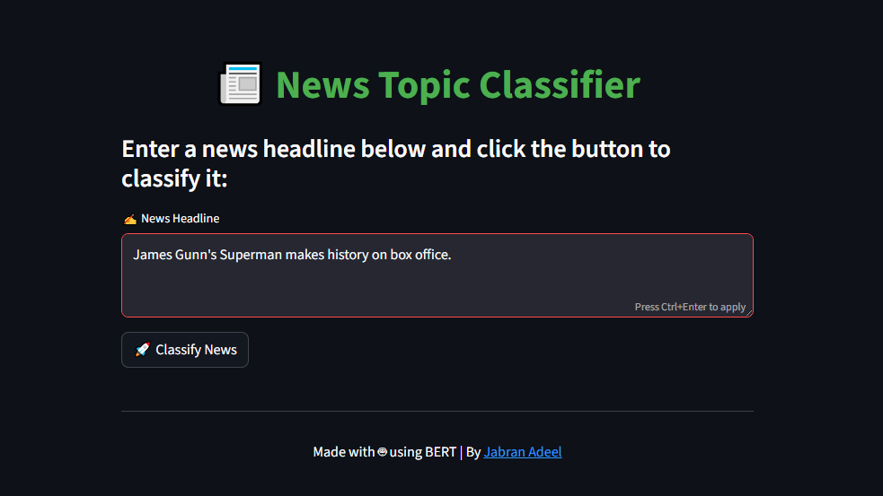
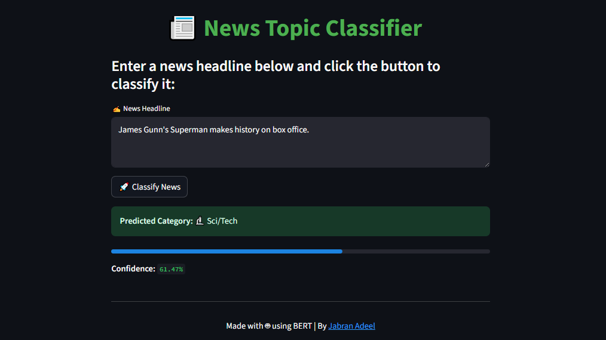

# 🧠 BERT News Topic Classifier

> A modern NLP project using Transformers to classify news headlines into four categories: **World**, **Sports**, **Business**, and **Sci/Tech** — deployed with a sleek **Streamlit web app**.

---



## 🚀 Overview

This project fine-tunes the `bert-base-uncased` model on the [AG News Dataset](https://huggingface.co/datasets/ag_news) using 🤗 Hugging Face Transformers. Once trained, it's wrapped in a **Streamlit app** with a modern, user-friendly interface where users can type any news headline and instantly receive a predicted category.

---

### 📊 Features

✅ Built with HuggingFace Transformers  
✅ Uses the AG News dataset  
✅ Fine-tuned using Trainer API  
✅ Evaluates accuracy & shows confusion matrix  
✅ Saved model & tokenizer  
✅ Fully interactive Streamlit interface  
✅ Clean and mobile-friendly design  
✅ Shows predictions live!

---

### 🛠 Tech Stack

- Python
- HuggingFace Transformers
- PyTorch
- Scikit-learn
- Pandas & Matplotlib
- Streamlit

---

### 🧪 Model Performance

| Metric       | Value  |
|--------------|--------|
| Accuracy     | ~94%   |
| Model        | `bert-base-uncased` |
| Dataset      | AG News |
| Classes      | World, Sports, Business, Sci/Tech |

---

## 🎯 Screenshots

### 🔹 Before Prediction


### 🔹 After Prediction


---

## 🖥️ Run Locally

### 📦 Install requirements
```bash
pip install -r requirements.txt
```
▶️ Run the app
```bash
streamlit run app.py
```

## 📁 Project Structure

bert_news_classifier/

├── main.py               Model training and saving

├── app.py                Streamlit frontend app

├── requirements.txt      Dependencies

├── screenshots/          UI previews

└── README.md             Project overview

## ✍️ Author

Made with ❤️ by 

## 📌 License

This project is licensed under the MIT License. See `LICENSE` for more details.
