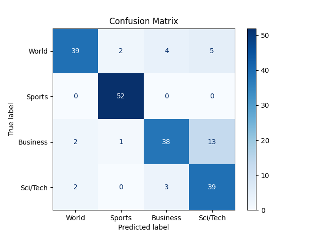

# 📰 BERT News Classifier

## 🚀 Overview

**BERT News Classifier** is a fine-tuned transformer-based NLP model built using Hugging Face’s `transformers` library. It classifies news headlines/articles into four major categories:

- 🌍 World  
- 🏈 Sports  
- 💼 Business  
- 🧪 Science/Technology  

This project uses the **AG News dataset** and fine-tunes the `bert-base-uncased` model for accurate multi-class text classification.

---

## 📦 Features

- ✅ Text preprocessing & tokenization using `AutoTokenizer`
- ✅ Fine-tuning BERT on AG News with Hugging Face `Trainer`
- ✅ Model evaluation with **accuracy** & **confusion matrix**
- ✅ Visualization of results for better interpretability
- ✅ Save & reuse trained model checkpoints

---

## 🛠️ Installation

1. Clone the repository:
   ```bash
   git clone https://github.com/jabran-adeel/bert-news-classifier.git
   cd bert-news-classifier
   
## Install required packages:
```bash
pip install -r requirements.txt
```
## ▶️ Usage:
Run the main training & evaluation script:
```bash
python main.py
```
After training, the model will automatically evaluate and generate a confusion matrix as `confusion_matrix.png`.

## 📊 Evaluation
<p align="center">  </p>
Metric: Accuracy

Model: `bert-base-uncased`

Epochs: 3

Batch Size: 8

Max Length: 512

## 📚 Technologies Used
🤗 Transformers

🔥 PyTorch

🧠 Scikit-learn

📊 Matplotlib & Seaborn

📑 Datasets (AG News)

## 🙌 Author
Made with ❤️ by [Jabran Adeel](https://github.com/jabran-adeel)

Connect with me on [LinkedIn](https://www.linkedin.com/in/jabran-adeel/)

## 📁 License
This project is open source under the MIT License.
